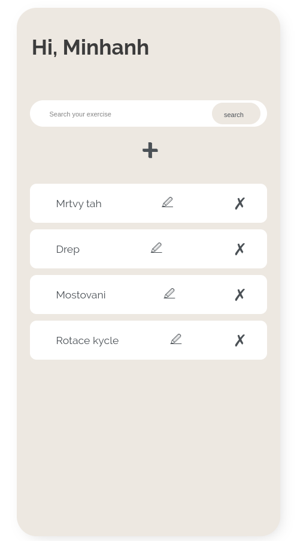
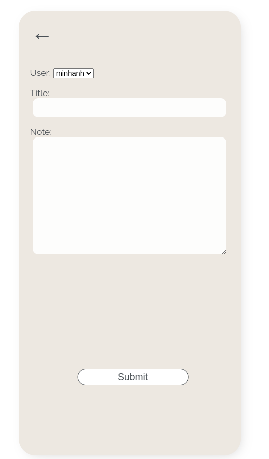
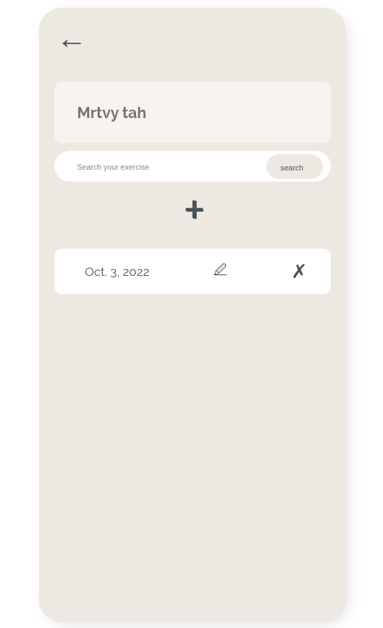
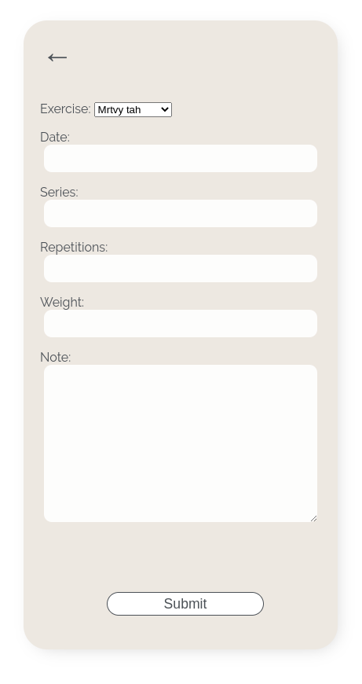

# Workout-Tracker
Exercise book and workout logger.
Build on Django.

## Features
- create, update and delete exercise
- create, update and delete workout seations

## How to run
Application is not production ready. 
A launch application for preview
- install requirements
- launch Django dev server from root of the project
```
python3 manage.py runserver
```
- visit: [workout-tracker](127.0.0.1:8000/workout-tracker/exercises/)

## App preview
 
 
 
 
